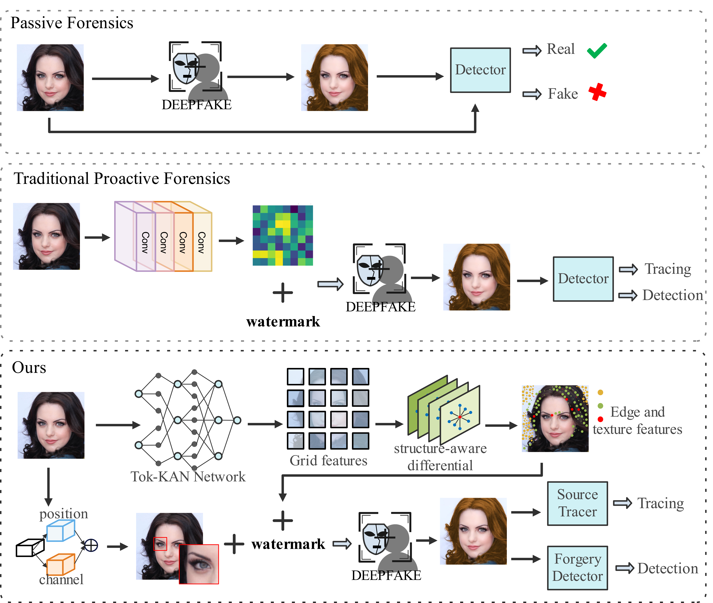

# KAD-Net: Kolmogorov-Arnold and Differential-Aware Networks for Robust and Sensitive Proactive Deepfake Forensics

> **⭐Abstract:**  
Deepfake technology can generate highly realistic fake images and videos, seriously threatening the public trust. Although proactive forensics methods offer stronger anti-forgery advantages, existing watermarking methods still suffer from insufficient semantic modeling and lack sensitivity to fine-grained facial structural deformations from deepfake manipulations. To address these challenges, we propose the Kolmogorov-Arnold Differential-aware Network (KAD-Net), a proactive forensic framework with two decoupled branches: the source tracing branch for robust tracing and the forgery detection branch for sensitive manipulation detection. In the source tracing branch, we propose a tokenized kolmogorov-arnold network (Tok-KAN) module, which leverages token partitioning and nonlinear mapping to enhance watermark adaptability to deepfake forgeries and enable reliable traceability. In addition, we propose a structure-aware differential module (SDM) that integrates multi-directional differential convolutions into equivalent kernels to enhance edge forgery perception and improve watermark recovery under complex distortions. In the forgery detection branch, we propose a structure-aware enhancement module (SAEM) to enhance forged region identification via spatial–channel feature modeling. Extensive experiments demonstrate that KAD-Net outperforms existing proactive forensics methods across various deepfake forgery and distortion scenarios.

---

## 📑 Overview Comparison
<p align="center">
  
</p>

<p align="center"><em>Comparison of feature modeling and forensic strategies in passive forensics, traditional proactive forensics, and our dual-branch proactive forensics framework.</em></p>

---

## 📑 Contents

- [Overview Comparison](#overview-comparison)
- [Network Architecture Overview](#-network-architecture-overview)
- [TODO](#-todo)
- [Objective Visual Quality of the Encoded Image](#-objective-visual-quality-of-the-encoded-image)
- [Evaluation of Watermark Source Tracing and Forgery Detection](#-evaluation-of-watermark-source-tracing-and-forgery-detection)
- [Environment Setup](#-environment-setup)
- [Datasets](#-datasets)
- [Noise Pool](#-noise-pool)
- [Training](#-training)
- [Testing](#-testing)
- [Visual Results](#-visual-results)
- [License](#-license)

---

## 🧠 Network Architecture Overview
<p align="center">
  
</p>
<p align="center"><em>The overall architecture of our KAD-Net.</em></p>

---

## ☑️ TODO
- [x] Project page released
- [x] Dataset preparation instructions released
- [ ] Release of core implementation
- [ ] Release of training and evaluation scripts
- [ ] Pretrained model and demo

---

## 📊 Objective Visual Quality of the Encoded Image

The table below compares the visual quality of encoded images produced by different watermarking methods, measured by PSNR and SSIM under different resolutions and message lengths.

| Model                        | Image Size     | Message<br>Length  | PSNR    | SSIM   |
|:------------------------:|:--------------:|:--------------:|:-------:|:------:|
| MBSR                     | 128×128        | 30             | 33.045  | 0.810  |
| CIN                      | 128×128        | 30             | 42.413  | 0.962  |
| PIMoG                    | 128×128        | 30             | 37.727  | 0.947  |
| SepMark                  | 128×128        | 30             | 38.511  | 0.958  |
| **Ours (ST)**            | 128×128        | 30             | 38.602  | 0.956  |
| **Ours (FD)**            | 128×128        | 30             | 40.928  | 0.966  |
| MBSR                     | 256×256        | 256            | 45.370  | 0.969  |
| FaceSigns                | 256×256        | 128            | 32.332  | 0.921  |
| SepMark                  | 256×256        | 128            | 38.565  | 0.933  |
| **Ours (ST)**            | 256×256        | 128            | 38.980  | 0.933  |
| **Ours (FD)**            | 256×256        | 128            | 40.068  | 0.941  |

---

## 🎯 Evaluation of Watermark Source Tracing and Forgery Detection

The following table reports the BER (%) of watermark extraction under various **common distortions** and **deepfake manipulations** at 128×128 and 256×256 resolution. Lower values indicate better traceability and detection robustness.

### 🧪 BER Results at 128×128 Resolution

| Distortion         | MBRS     | CIN      | PIMoG    | SepMark-Tracer | SepMark-Detector | KAD-Net-ST | KAD-Net-FD |
|:------------------:|:--------:|:--------:|:--------:|:--------------:|:----------------:|:----------:|:----------:|
| Identity           | 0.0000%  | 0.0000%  | 0.0366%  | 0.0000%        | 0.0000%          | 0.0000%    | 0.0000%    |
| JpegTest           | 0.2597%  | 2.7514%  | 19.5562% | 0.2136%        | 0.2172%          | 0.0967%    | 0.0283%    |
| Resize             | 0.0000%  | 0.0000%  | 0.0767%  | 0.0059%        | 0.0212%          | 0.0000%    | 0.0000%    |
| GaussianBlur       | 0.0000%  | 22.7786% | 0.1169%  | 0.0024%        | 0.0035%          | 0.0000%    | 0.0000%    |
| MedianBlur         | 0.0000%  | 0.0307%  | 0.0992%  | 0.0012%        | 0.0012%          | 0.0000%    | 0.0000%    |
| Brightness         | 0.0000%  | 0.0000%  | 1.3443%  | 0.0059%        | 0.0106%          | 0.0000%    | 0.0000%    |
| Contrast           | 0.0000%  | 0.0000%  | 0.8121%  | 0.0012%        | 0.0024%          | 0.0011%    | 0.0011%    |
| Saturation         | 0.0000%  | 0.0000%  | 0.0803%  | 0.0000%        | 0.0000%          | 0.0000%    | 0.0000%    |
| Hue                | 0.0000%  | 0.0000%  | 0.1523%  | 0.0000%        | 0.0012%          | 0.0000%    | 0.0000%    |
| Dropout            | 0.0000%  | 0.0000%  | 0.4828%  | 0.0000%        | 0.0000%          | 0.0000%    | 0.0000%    |
| SaltPepper         | 0.0000%  | 0.0378%  | 2.3667%  | 0.0413%        | 0.0106%          | 0.0047%    | 0.0011%    |
| GaussianNoise      | 0.0000%  | 0.0000%  | 12.7396% | 0.7460%        | 0.8735%          | 3.0000%    | 0.3670%    |
| **Avg (Common)**   | 0.0216%  | 2.1322%  | 3.1553%  | 0.0848%        | 0.0951%          | 0.0215%    | 0.0331%    |
| SimSwap            | 19.3744% | 48.5068% | 8.6745%  | 13.8255%       | 50.8829%         | 13.1480%   | 50.2927%   |
| GANimation         | 0.0000%  | 0.0000%  | 0.4802%  | 0.0000%        | 36.7938%         | 0.0082%    | 49.5443%   |
| StarGAN (Male)     | 18.3133% | 67.2568% | 9.2044%  | 0.1157%        | 52.6003%         | 0.0212%    | 51.2157%   |
| StarGAN (Young)    | 17.0562% | 69.0805% | 8.7465%  | 0.1074%        | 52.3678%         | 0.0094%    | 51.6135%   |
| StarGAN (BlackHair)| 19.2233% | 58.7913% | 10.5312% | 0.1416%        | 49.2434%         | 0.0106%    | 51.2747%   |
| StarGAN (BlondHair)| 18.4478% | 72.9733% | 10.3506% | 0.1712%        | 48.6084%         | 0.0259%    | 50.9112%   |
| StarGAN (BrownHair)| 17.6381% | 79.5857% | 9.0675%  | 0.0980%        | 52.3820%         | 0.0129%    | 50.8734%   |
| **Avg (Deepfake)** | 15.7219% | 56.5992% | 8.1507%  | 2.0656%        | 48.9827%         | 1.8909%    | 50.8179%   |

### 🧪 BER Results at 256×256 Resolution
| Distortion         | FaceSigns | SepMark-Tracer | SepMark-Detector | KAD-Net-ST | KAD-Net-FD |
|:------------------:|:---------:|:--------------:|:----------------:|:----------:|:----------:|
| Identity           | 0.0136%   | 0.0000%        | 0.0000%          | 0.0000%    | 0.0000%    |
| JpegTest           | 0.8258%   | 0.0075%        | 0.0069%          | 0.0038%    | 0.0019%    |
| Resize             | 1.0726%   | 0.0000%        | 0.0000%          | 0.0000%    | 0.0000%    |
| GaussianBlur       | 0.1671%   | 0.0000%        | 0.0274%          | 0.0000%    | 0.0000%    |
| MedianBlur         | 0.0977%   | 0.0000%        | 0.0000%          | 0.0000%    | 0.0000%    |
| Brightness         | 10.8196%  | 0.0171%        | 0.0300%          | 0.0000%    | 0.0000%    |
| Contrast           | 0.0334%   | 0.0000%        | 0.0000%          | 0.0000%    | 0.0000%    |
| Saturation         | 0.7113%   | 0.0000%        | 0.0000%          | 0.0000%    | 0.0000%    |
| Hue                | 8.3780%   | 0.0000%        | 0.0000%          | 0.0000%    | 0.0000%    |
| Dropout            | 17.5615%  | 0.0058%        | 0.0000%          | 0.0000%    | 0.0000%    |
| SaltPepper         | 12.3283%  | 0.0008%        | 0.0003%          | 0.0000%    | 0.0000%    |
| GaussianNoise      | 7.0697%   | 0.0578%        | 0.0622%          | 0.0000%    | 0.0199%    |
| **Avg (Common)**   | 4.9228%   | 0.0061%        | 0.0083%          | 0.0003%    | 0.0018%    |
| SimSwap            | 49.9463%  | 7.9068%        | 45.9117%         | 4.1217%    | 50.5804%   |
| GANimation         | 45.4172%  | 0.0020%        | 43.8524%         | 0.0000%    | 52.5570%   |
| StarGAN (Male)     | 50.2617%  | 0.0033%        | 45.4624%         | 0.0000%    | 54.9392%   |
| StarGAN (Young)    | 50.3649%  | 0.0030%        | 45.5319%         | 0.0000%    | 57.2362%   |
| StarGAN (BlackHair)| 50.2576%  | 0.0019%        | 45.1299%         | 0.0000%    | 54.8435%   |
| StarGAN (BlondHair)| 50.9829%  | 0.0022%        | 44.6953%         | 0.0027%    | 53.8025%   |
| StarGAN (BrownHair)| 50.7884%  | 0.0017%        | 45.9950%         | 0.0000%    | 56.0497%   |
| **Avg (Deepfake)** | 49.7170%  | 1.1316%        | 45.2055%         | 0.5892%    | 54.2869%   |

---


## 🖥️ Environment Setup

```bash
conda env create -f requirements.yml

```


---


## 📁 Datasets
KAD-Net was trained on the CelebA-HQ dataset and evaluated on CelebA-HQ, CelebA, and LFW datasets at resolutions of 128×128 and 256×256. We do not own these datasets; they can be obtained from their respective official websites.  
  [🔗 CelebA-HQ](https://github.com/tkarras/progressive_growing_of_gans)  
  [🔗 CelebA](https://mmlab.ie.cuhk.edu.hk/projects/CelebA.html)  
  [🔗 LFW](http://vis-www.cs.umass.edu/lfw/)  

---

## 🌪️ Noise Pool
The noise pool includes two types of distortions:

1. **Common image distortions**: `Identity`, `JPegTest`, `Resize`, `GaussianBlur`, `MedianBlur`, `Brightness`, `Contrast`, `Saturation`, `Hue`, `Dropout`, `SaltPepper`, `GaussianNoise`.

2. **Deepfake-related malicious distortions**:   
[🔗 SimSwap](https://arxiv.org/abs/2106.06340): Identity-aware face swapping with high-quality alignment.  
[🔗 GANimation](https://arxiv.org/abs/1807.09251): Expression manipulation via conditional adversarial networks.   
[🔗 StarGAN](https://arxiv.org/abs/1801.00699): Multi-domain attribute translation (e.g., hair color, age, gender).  

---


## 🏋️‍♂️ Training

```bash
python train.py
```
---

## 🔎 Testing
```bash
python test.py
```

---

## 🔍 Visual Results
<p align="center">
  
</p>
<p align="center"><em>Visualization of various noise effects applied to the image, including common distortions and deepfake manipulations. The first row is the original image, the second row is the watermarked image, and the third row is the watermarked image after noise distortion. The fourth row is the extracted watermark residual signal, and the fifth row is the impact of noise distortion on the watermark residual signal.</em></p>

---

## 🧾 License

This repository is released under the [Apache 2.0 License](LICENSE).

---

